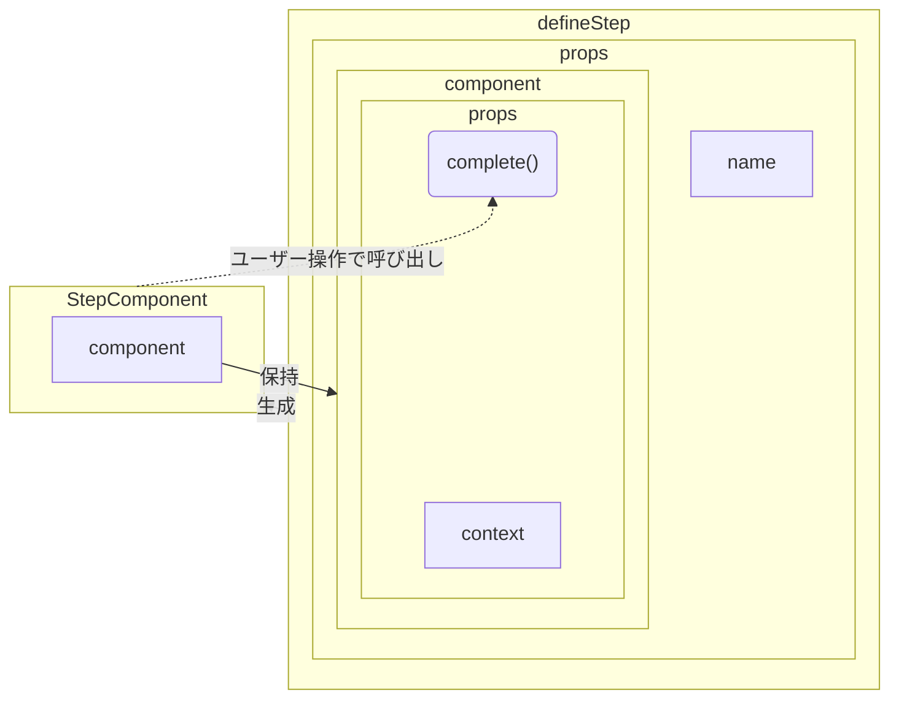

```mermaid
flowchart BT
    subgraph defineStep
        subgraph defineStep_props["props"]
            name
            subgraph component
                subgraph component_props["props"]
                    context
                    complete("complete()")
                end
            end
        end
    end

    subgraph StepComponent
        wrappedComponent["component"]
    end


    defineStep -->|生成| StepComponent
    wrappedComponent -->|保持| component

    StepComponent -.->|ユーザー操作で呼び出し| complete
```
